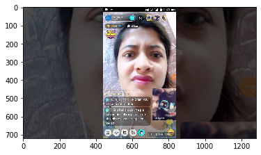
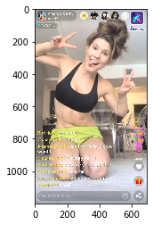

# Live Me Id Extractor

This repository contains the module which makes it possible to extract live me id from live me screenshots using super-deep image-based pre-processing and exploration. This repository uses features from another repository developed as a part of this project: https://github.com/UMass-Rescue/deep_text_detection.

## Suitability

This module is suitable for detecting live_me id across screenshots captured from web/phone/screen-capture. Further, it can be ideal for scenarios where such an image is actually part of a larger image collage. Presently, it supports only single id extraction, but it's relatively straightforward to extend it to multiple id detection in case of image collages of multiple ids.

## Usage of main module: search_user_id

Parameters Invoked | Default Argument | Description
--- | --- | ----
im | **Required** | Required image variable of type np.ndarray or image path
abandon_search_length | 6 | If it finds alphabetic string above this length, it drops the edge enhancement search and moves to the next box.
minimum_string_length | 3 | The numeric string detected has to be of minimum length of 3 to avoid ambiguity with other numbers on the screen. Can be tuned further with a better understanding of the data.
advanced | False | If turned on, it performs detail enhancement based configurability search. Can be tuned further with a better understanding of the data.

```python
# Required packages (general)
from live_me_id_extractor import extract_user_id
from matplotlib.image import imread

# Demo-specific packages (not required for the working of this module) 
from matplotlib import pyplot as plt
import os
```

```python
# Using image as numpy array 
base_path = 'dataset/live_me/'
image_path = os.path.join(base_path, 'tani_gupta.jpg')
im = imread(image_path)
plt.imshow(im)
```




```python
detected_text, user_info = extract_user_id(im)
print ("Detected Text = {}".format(detected_text))
if user_info is not None:
    print ("User Information = {}".format(user_info))
```

    Detected Text = 468
    User Information = [{'display_name': 'toxik', '_id': '468', 'name': 'toxik', 'type': 'user', 'bio': None, 'created_at': '2007-05-22T10:37:50.875785Z', 'updated_at': '2020-03-30T04:57:13.301866Z', 'logo': 'https://static-cdn.jtvnw.net/user-default-pictures-uv/13e5fa74-defa-11e9-809c-784f43822e80-profile_image-300x300.png'}]
  

```python
# Using image file, no-array
detected_text, user_info = extract_user_id(image_path)
print ("Detected Text = {}".format(detected_text))
if user_info is not None:
    print ("User Information = {}".format(user_info))
```

    Detected Text = 468
    User Information = [{'display_name': 'toxik', '_id': '468', 'name': 'toxik', 'type': 'user', 'bio': None, 'created_at': '2007-05-22T10:37:50.875785Z', 'updated_at': '2020-03-30T04:57:13.301866Z', 'logo': 'https://static-cdn.jtvnw.net/user-default-pictures-uv/13e5fa74-defa-11e9-809c-784f43822e80-profile_image-300x300.png'}]

```python
# Demo 2
image_path = os.path.join(base_path, 'amanda_cerny.jpg')
im = imread(image_path)
plt.imshow(im)
```




```python
detected_text, user_info = extract_user_id(im)
print ("Detected Text = {}".format(detected_text))
if user_info is not None:
    print ("User Information = {}".format(user_info))
```

    Detected Text = 344
    User Information = [{'display_name': 'dobro_restart', '_id': '344', 'name': 'dobro_restart', 'type': 'user', 'bio': None, 'created_at': '2018-09-04T15:20:10.804593Z', 'updated_at': '2018-09-04T17:38:33.146777Z', 'logo': 'https://static-cdn.jtvnw.net/user-default-pictures-uv/cdd517fe-def4-11e9-948e-784f43822e80-profile_image-300x300.png'}]

```python
# Using image file, no-array
detected_text, user_info = extract_user_id(image_path)
print ("Detected Text = {}".format(detected_text))
if user_info is not None:
    print ("User Information = {}".format(user_info))
```

    Detected Text = 344
    User Information = [{'display_name': 'dobro_restart', '_id': '344', 'name': 'dobro_restart', 'type': 'user', 'bio': None, 'created_at': '2018-09-04T15:20:10.804593Z', 'updated_at': '2018-09-04T17:38:33.146777Z', 'logo': 'https://static-cdn.jtvnw.net/user-default-pictures-uv/cdd517fe-def4-11e9-948e-784f43822e80-profile_image-300x300.png'}]
